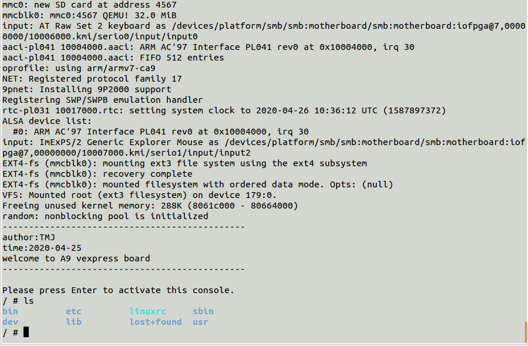

## qemu搭建arm开发环境
    最近想学习Linux驱动开发相关的知识，但是身边没有arm开发板，网上的开发板也是各式各样，后续自己了解到qemu工具，想着用qemu自己搭建一个arm开发板，通过qemu-system-arm学习嵌入式开发、研究BootLoader、Linux内核、驱动开发。
---
> 开发环境 ：Ubuntu 14.04.6 LTS amd64     
uboot: u-boot-2018.11  
Linux: linux-4.4.76  
busybox：busybox-1.20.2 
---
### 交叉编译环境配置
1. 首先安装qemu，在Ubuntu下面直接可以自动安装：  
`sudo apt-get install qemu`  
2. 由于arm开发板的架构和x86架构有区别，其指令系统是不一样的，所以编译工具链也是不一样的，我们这里要搭建的开发板vexpress-a9是arm架构的需要安装的交叉编译工具链是：arm-linux-gnueabi-  
`sudo apt-get install arm-linux-gnueabi`

### 编译Linux内核镜像和dtb文件

#### 1. 下载Linux内核
1)、官方网站   
https://www.kernel.org/  
2）、由于官方网站下载速度极慢，故提供其他链接：  
http://ftp.sjtu.edu.cn/sites/ftp.kernel.org/pub/linux/kernel/

#### 2. 解压内核
使用tar、zx解压内核linux-4.4.76.tar.xz文件：  
`xz -d linux-4.4.76.tar.xz`  
`tar -xvf linux-4.4.76.tar`

#### 3. 修改Makefile
`ARCH=arm`  
`CROSS_COMPILE=arm-linux-gnueabi-`

#### 4. 编译内核、模块、dtb文件
>make vexpress_defconfig // 使用内核中的默认vexpress架构的配置  
去掉System Type 把 Enable the L2x0 outer cache controller 取消，否则qemu起不来  
make zImage -j4 // 编译zImage   
make dts -j4 // 编译设备树  
make modules // 编译内核外模块  
通过以上步骤可以在 linux-4.4.76/arch/arm/boot/ 目录下面生成zImage以及相关文件 

#### 5. 运行Linux内核
增加脚本文件运行自己编译生成的zImage文件：
>qemu-system-arm \  
          -M vexpress-a9 \  
          -m 512M \  
          -kernel linux-4.4.76/arch/arm/boot/zImage \  
          -dtb linux-4.4.76/arch/arm/boot/dts/vexpress-v2p-ca9.dtb \  
          -nographic \  
          -append "console=ttyAMA0" 

其中参数作用分别为：
>-M vexpress-a9 模拟vexpress-a9单板，你能够使用-M ?參数来获取该qemu版本号支持的全部单板  
-m 512M 单板执行物理内存512M  
-kernel arch/arm/boot/zImage   告诉qemu单板执行内核镜像路径  
-dtb arch/arm/boot/dts/vexpress-v2p-ca9.dtb  告诉qemu单板的设备树（必须加入）  
-nographic 不使用图形化界面，仅仅使用串口  
-append "console=ttyAMA0" 内核启动參数。这里告诉内核vexpress单板执行。串口设备是哪个tty。

### 使用busybox制作根文件系统
1. 什么是根文件系统  
    + Linux内核启动后的第一个挂载的文件系统
    + 主要又基本的shell命令、各种库、字符设备、配置脚本组成
    + 提供了根目录
2. 什么是busybox
    + 一个集成了100多个Linux常用命令和工具的软件
    + 一个适合制作嵌入式文件系统的软件工具
3. 编译安装
    + 下载源码：https://busybox.net/downloads/
    + 修改makefile：ARCH=arm CROSS_COMPILE=arm-linux-gnueabi-
    + 配置：make defconfig ; make menuconfig   
    Build BusyBox as a static binary (no shared libs)  //使用静态编译译
    + 编译：make -j4  
    + 安装：make install  
    在_install目录下面生成需要的shell命令
4. 制作根文件系统
    + mkdir rootfs
    + cp -r _install/* rootfs
    + mkdir -p rootfs/dev
    + 创建设备文件  
    sudo mknod rootfs/dev/tty1 c 4 1  
    sudo mknod rootfs/dev/tty2 c 4 2  
    sudo mknod rootfs/dev/tty3 c 4 3  
    sudo mknod rootfs/dev/tty4 c 4 4  
    sudo mknod rootfs/dev/console c 5 1  
    sudo mknod rootfs/dev/null c 1 3  
    + 生成一个空的文件作为文件系统  
    sudo dd if=/dev/zero of=rootfs.ext3 bs=1M count=32  
    sudo mkfs.ext3 -t ext3 rootfs.ext3
    + 将文件系统挂载到tmpfs目录下  
    sudo mkdir -p tmpfs  
    sudo mount -t ext3 rootfs.ext3 tmpfs/ -o loop  
    + 将之前创建的文件系统相关的文件放到通过tmpfs放到rootfs.ext3文件系统中去  
    sudo cp -r rootfs/*  tmpfs/  
    sudo umount tmpfs  
5. 运行文件系统和内核  
    增加脚本运行zImage内核以及根文件系统
    >qemu-system-arm \
        -M vexpress-a9 \
        -m 512M \
        -kernel linux-4.4.76/arch/arm/boot/zImage \
        -dtb linux-4.4.76/arch/arm/boot/dts/vexpress-v2p-ca9.dtb \
        -nographic \
        -append "root=/dev/mmcblk0 rw console=ttyAMA0" \
        -sd rootfs.ext3

    相比于只启动zImage多余参数作用：
    >-append "root=/dev/mmcblk0 rw console=ttyAMA0" 内核启动參数。这里告诉内核那个文件系统。rw读写权限  
    -sd a9rootfs.ext3   挂载根文件系统为sk卡

### 通过Uboot运行uImage
    运行uImage这里需要同u-boot来进行内核的加载。这个加载的过程中需要使用到tftp来进行内核镜像的传输。tftp是一种基于udp的简单tfp传输软件。默认端口是69。
1. 安装tftp  
    + 安装tftp依赖软件  
    sudo apt-get install tftp-hpa tftpd-hpa xinetd
    + 配置tftp服务器如下  
    sudo vi /etc/default/tftpd-hpa
        >TFTP_USERNAME="tftp"  
        TFTP_DIRECTORY="/home/xiaotan/tftpboot"  
        TFTP_ADDRESS="0.0.0.0:69"  
        TFTP_OPTIONS="-l -c -s"
    + 重启tftp服务  
    sudo service tftpd-hpa restart
2. 编译uboot和uImage
    + 修改uboot代码  
        >`#define CONFIG_IPADDR   169.254.7.1`  
        `#define CONFIG_NETMASK  255.255.0.0`   
        `#define CONFIG_SERVERIP 169.254.7.4`  
        `修改启动文件为uImage`  
        `#define CONFIG_BOOTFILE                "uImage"`  
        `修改启动命令为`  
        `#define CONFIG_BOOTCOMMAND  "tftp 0x60003000 uImage; tftp 0x60500000 vexpress-v2p-ca9.dtb; setenv bootargs \"root=/dev/mm    cblk0 rw console=ttyAMA0\"; bootm 0x60003000 - 0x60500000"`
    + 重新编译:make -j4
    + kernel重新编译(LOADADDR和uboot的启动加载位置一致,这个地址是开发板的ddr地址)  
    make uImage LOADADDR=0x60003000 –j4 
    + 将之前编译生成的u-boot、uImage、vexpress-v2p-ca9.dtb、rootfs.ext3拷贝到tftp路径
    + 编写boot.sh脚本帮忙启动uboot
        >qemu-system-arm \
            -M vexpress-a9 \
            -m 512M \
            -kernel u-boot \
            -nographic \
            -net nic,vlan=0 -net tap,vlan=0,ifname=tap0 \
            -sd rootfs.ext3
    + 运行脚本就能进入系统，效果入下：
    